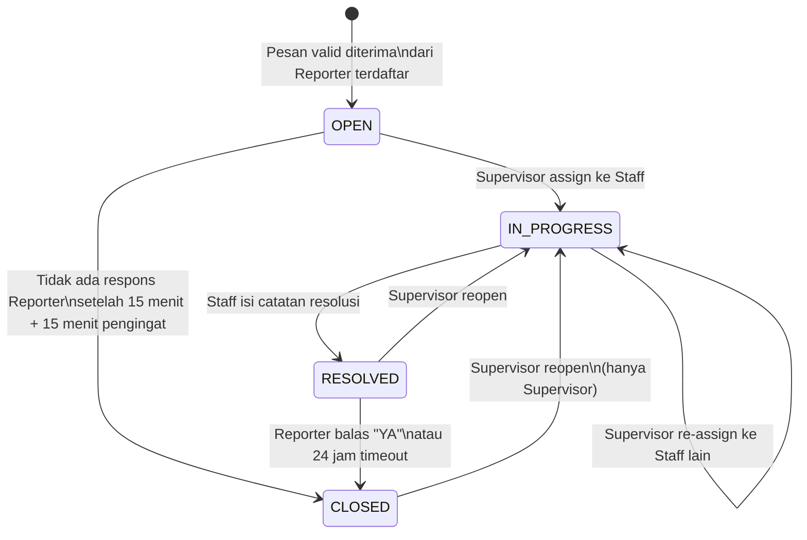

# Design Document: WhatsApp Ticketing System

## Overview

WhatsApp Ticketing System adalah aplikasi web internal yang mengintegrasikan WhatsApp Business API dengan sistem manajemen tiket untuk memungkinkan karyawan (Reporter) melaporkan error pada aplikasi internal perusahaan melalui WhatsApp, tanpa perlu menginstal aplikasi baru.

Sistem ini terdiri dari tiga lapisan utama:

1. **WhatsApp Gateway Layer** — menerima pesan masuk via webhook dari Meta Cloud API dan mengirim balasan otomatis melalui Bot Responder (diproses via Upstash QStash job queue).
2. **Core Ticketing Backend** — Next.js Route Handlers memproses pesan masuk, mengelola siklus hidup tiket, dan meng-enqueue background jobs (reminder, auto-close) ke QStash. Semua state tersimpan di Supabase (PostgreSQL + Storage + Auth).
3. **Web Dashboard** — antarmuka Next.js 14 (App Router) untuk Staff dan Supervisor, menerima update real-time via Supabase Realtime (Postgres Changes subscription), di-deploy bersama backend ke Vercel dalam satu project.

> **Catatan arsitektur:** Sistem di-deploy ke **Vercel** sebagai serverless environment. Ini berarti tidak ada persistent process — tidak ada long-running BullMQ worker, tidak ada WebSocket server custom. Semua fungsi background dijalankan sebagai serverless function yang dipanggil oleh **Upstash QStash** (HTTP-based queue), dan real-time push ke browser dilakukan via **Supabase Realtime** yang menggunakan Postgres Changes subscription langsung dari frontend.

### Teknologi Utama

| Layer | Teknologi |
|---|---|
| Framework | Next.js 14 (App Router) — frontend + API Routes dalam satu project |
| Runtime | Node.js 20 LTS + TypeScript |
| Database | Supabase (PostgreSQL 15 managed) |
| Job Queue | Upstash QStash (HTTP-based, serverless-compatible) |
| Real-time | Supabase Realtime (Postgres Changes subscription) |
| WhatsApp | Meta Cloud API (WhatsApp Business Platform) |
| Auth | Supabase Auth (dengan custom role via `user_metadata`) |
| File Storage | Supabase Storage |
| Cache / Sequence | Upstash Redis (hanya untuk ticket sequence counter) |
| Hosting | Vercel (serverless, auto-deploy dari Git) |
| Frontend Styling | TailwindCSS |


---

## Architecture

Sistem menggunakan arsitektur **Next.js fullstack monorepo** — satu project Next.js 14 (App Router) yang memuat frontend dan API Routes sekaligus, di-deploy ke Vercel sebagai serverless functions. Tidak ada server persisten; semua background work didelegasikan ke Upstash QStash yang memanggil API Route endpoint sebagai HTTP callbacks.

```mermaid
graph TB
    subgraph External
        WA[WhatsApp Business API\nMeta Cloud API]
        Reporter[Reporter\nKaryawan via WhatsApp]
    end

    subgraph Vercel [Vercel - Serverless Functions]
        WH[Webhook Handler\nPOST /api/webhook/whatsapp]
        MSG[Message Processor\nPOST /api/jobs/process-message]
        TICK[Ticket Service\nlib/tickets]
        BOT[Bot Responder\nPOST /api/jobs/bot-reply]
        AUTH[Auth Middleware\nSupabase Auth]
        REPORT[Report Service\nlib/reports]
        API[API Routes\n/api/v1/...]
    end

    subgraph QStash [Upstash QStash]
        Q_MSG[message-processor topic]
        Q_BOT[bot-reply topic]
        Q_TIMER[timer-jobs topic]
    end

    subgraph Supabase
        PG[(PostgreSQL\nDatabase)]
        RT[Realtime\nPostgres Changes]
        STORE[Storage\nAttachments]
        SAUTH[Supabase Auth\nJWT + user_metadata]
    end

    subgraph UpstashRedis [Upstash Redis]
        SEQ[ticket:seq counter]
    end

    subgraph Frontend [Frontend - Next.js App Router]
        WEB[Web Dashboard\nReact Server + Client Components]
    end

    Reporter -->|Pesan WhatsApp| WA
    WA -->|Webhook POST| WH
    WH -->|Enqueue job| Q_MSG
    Q_MSG -->|HTTP callback| MSG
    MSG --> TICK
    MSG -->|Enqueue reply| Q_BOT
    TICK --> PG
    TICK -->|Enqueue timer| Q_TIMER
    Q_BOT -->|HTTP callback| BOT
    BOT -->|Send Message| WA
    Q_TIMER -->|HTTP callback| API
    AUTH --> SAUTH
    REPORT --> PG
    API --> TICK
    API --> AUTH
    API --> REPORT
    TICK --> SEQ
    TICK --> STORE
    PG -->|Postgres Changes| RT
    RT -->|Realtime subscription| WEB
    WEB -->|fetch()| API
```

### Aliran Data Utama

**Pesan masuk (Reporter → Tiket):**
1. Reporter kirim pesan WhatsApp → Meta Cloud API
2. Meta POST ke `POST /api/webhook/whatsapp` (Webhook Handler — serverless function)
3. Webhook Handler memverifikasi signature (`X-Hub-Signature-256`), segera respond `200 OK`, lalu enqueue job ke **Upstash QStash** topic `message-processor`
4. QStash memanggil `POST /api/jobs/process-message` (HTTP callback): validasi nomor, buat/update Tiket di Supabase PostgreSQL
5. Bot Responder di-enqueue ke QStash topic `bot-reply` → QStash memanggil `POST /api/jobs/bot-reply` → Meta Cloud API → Reporter
6. Database write ke Supabase PostgreSQL otomatis memicu **Supabase Realtime Postgres Changes** event → semua browser yang subscribe (Staff/Supervisor yang sedang login) menerima update real-time tanpa WebSocket server custom

**Tiket update (Staff/Supervisor → Reporter):**
1. Staff/Supervisor request via Next.js API Route
2. Ticket Service update Supabase database, catat audit trail
3. Jika status berubah → Bot reply di-enqueue ke QStash → dikirim ke Reporter via WhatsApp
4. Supabase Realtime otomatis broadcast Postgres Change event ke semua subscriber aktif


---

## Components and Interfaces

### 1. Webhook Handler

Menerima dan memvalidasi semua event dari Meta Cloud API.

```typescript
// app/api/webhook/whatsapp/route.ts
// POST /api/webhook/whatsapp
// GET  /api/webhook/whatsapp  (verifikasi endpoint saat setup)

interface WhatsAppWebhookPayload {
  object: 'whatsapp_business_account';
  entry: WebhookEntry[];
}

interface WebhookEntry {
  id: string;
  changes: WebhookChange[];
}

interface WebhookChange {
  value: {
    messaging_product: 'whatsapp';
    metadata: { display_phone_number: string; phone_number_id: string };
    contacts?: [{ profile: { name: string }; wa_id: string }];
    messages?: IncomingMessage[];
    statuses?: MessageStatus[];
    errors?: WebhookError[];
  };
  field: 'messages';
}

interface IncomingMessage {
  from: string;          // nomor WA pengirim (tanpa +)
  id: string;            // WA message ID
  timestamp: string;     // unix timestamp string
  type: 'text' | 'image' | 'document' | 'sticker' | 'reaction' | 'audio' | 'video';
  text?: { body: string };
  image?: { id: string; mime_type: string; sha256: string };
  document?: { id: string; filename: string; mime_type: string; sha256: string };
}
```

**Keputusan desain:** Validasi signature dilakukan di middleware sebelum handler dipanggil. Setelah validasi, pesan di-enqueue ke **Upstash QStash** (bukan diproses langsung) agar webhook bisa merespons `200 OK` dalam <1 detik sesuai requirement Meta. QStash kemudian memanggil endpoint `/api/jobs/process-message` secara async dengan built-in retry.


### 2. Message Processor (QStash Job Handler)

Dipanggil oleh QStash sebagai HTTP callback ke `POST /api/jobs/process-message`. Setiap invocation adalah serverless function yang stateless.

```typescript
// app/api/jobs/process-message/route.ts
// Dipanggil oleh QStash — bukan endpoint publik (divalidasi via QStash signature)

interface ProcessMessageJob {
  waMessageId: string;
  fromNumber: string;       // e.g. "628123456789"
  timestamp: Date;
  type: IncomingMessage['type'];
  text?: string;
  attachment?: {
    waMediaId: string;
    mimeType: string;
    filename?: string;
  };
}

// Output dari Message Processor
type ProcessMessageResult =
  | { action: 'ticket_created'; ticketId: string }
  | { action: 'ticket_updated'; ticketId: string }
  | { action: 'unregistered_reporter' }
  | { action: 'invalid_format' }
  | { action: 'ticket_creation_failed'; error: string };
```

**Logika routing pesan masuk:**
1. Cek apakah `fromNumber` terdaftar sebagai Reporter → jika tidak: enqueue bot-reply penolakan ke QStash
2. Cek `type` → jika bukan `text`, `image`, atau `document`: enqueue bot-reply `INVALID_FORMAT`
3. Cari Tiket aktif terakhir milik Reporter:
   - Tidak ada Tiket aktif → buat Tiket baru (status OPEN)
   - Ada Tiket OPEN → lampirkan pesan ke riwayat Tiket yang sama
   - Ada Tiket IN_PROGRESS/RESOLVED/CLOSED → informasikan status dan tawarkan laporan baru

### 3. Ticket Service

Interface utama untuk semua operasi CRUD tiket.

```typescript
interface TicketService {
  // Membuat tiket baru dari pesan WhatsApp
  createTicket(params: CreateTicketParams): Promise<Ticket>;

  // Menambah pesan/lampiran ke tiket yang ada
  appendMessage(ticketId: string, message: TicketMessage): Promise<void>;

  // Mengubah status tiket (dengan validasi transisi)
  updateStatus(ticketId: string, newStatus: TicketStatus, updatedBy: UserId, note?: string): Promise<Ticket>;

  // Menugaskan atau mengalihkan Staff
  assignStaff(ticketId: string, staffId: UserId, supervisorId: UserId, reason?: string): Promise<Ticket>;

  // Menyimpan catatan resolusi dan mengubah status ke RESOLVED
  resolveTicket(ticketId: string, staffId: UserId, resolutionNote: string): Promise<Ticket>;

  // Daftar tiket dengan filter dan pagination
  listTickets(filter: TicketFilter, pagination: Pagination): Promise<PaginatedResult<TicketSummary>>;

  // Detail tiket lengkap dengan riwayat
  getTicketDetail(ticketId: string): Promise<TicketDetail>;
}

interface CreateTicketParams {
  reporterPhone: string;
  reporterName: string;
  initialMessage: string;
  waMessageId: string;
  receivedAt: Date;
}

interface TicketFilter {
  status?: TicketStatus[];
  appName?: string;
  assignedStaffId?: UserId;
  dateFrom?: Date;
  dateTo?: Date;
  search?: string;   // nomor tiket, nama Reporter, kata kunci deskripsi (min 3 char)
}
```


### 4. Bot Responder Service

Mengirim pesan ke Reporter via Meta Cloud API.

```typescript
interface BotResponderService {
  sendTicketCreated(phone: string, ticket: Ticket): Promise<void>;
  sendGuidanceRequest(phone: string, ticketId: string): Promise<void>;
  sendStatusUpdate(phone: string, ticket: Ticket): Promise<void>;
  sendAssignmentNotification(phone: string, ticket: Ticket, staffName: string): Promise<void>;
  sendResolutionConfirmation(phone: string, ticket: Ticket, summary: string): Promise<void>;
  sendUnregisteredReply(phone: string): Promise<void>;
  sendInvalidFormatReply(phone: string): Promise<void>;
  sendGuidanceReminder(phone: string, ticketId: string): Promise<void>;
  sendError(phone: string): Promise<void>;
}

// Internal: semua pengiriman diproses via QStash bot-reply topic untuk retry otomatis
interface BotReplyJob {
  templateKey: keyof BotResponderService;
  phone: string;
  payload: Record<string, unknown>;
}
```

**Keputusan desain:** Semua pesan bot di-enqueue ke **Upstash QStash** yang kemudian memanggil `POST /api/jobs/bot-reply` sebagai HTTP callback. QStash menyediakan built-in retry dengan exponential backoff (3 attempts: 2s, 4s, 8s), tanpa perlu worker process yang berjalan terus-menerus — kompatibel dengan serverless Vercel. Setelah semua retry habis, QStash memindahkan job ke Dead Letter Queue dan Supervisor dinotifikasi.

### 5. Auth Service

Auth dikelola sepenuhnya oleh **Supabase Auth**. Role (STAFF/SUPERVISOR) disimpan di `user_metadata` pada setiap user record Supabase dan dibaca dari JWT yang diterbitkan Supabase.

```typescript
// lib/auth/supabase-auth.ts

interface AuthService {
  // Login menggunakan Supabase Auth email+password
  login(username: string, password: string): Promise<AuthTokens>;
  // Refresh token dikelola otomatis oleh Supabase client SDK
  refreshToken(refreshToken: string): Promise<AuthTokens>;
  // Invalidate session di Supabase
  logout(): Promise<void>;
  // Validasi JWT dari Supabase dan baca role dari user_metadata
  validateSession(accessToken: string): Promise<AuthenticatedUser>;
}

interface AuthTokens {
  accessToken: string;    // Supabase JWT, berlaku sesuai konfigurasi Supabase (default 1 jam)
  refreshToken: string;   // Dikelola oleh Supabase Auth, berlaku 7 hari
}

interface AuthenticatedUser {
  userId: string;
  username: string;
  role: 'STAFF' | 'SUPERVISOR';  // Dibaca dari user_metadata.role di Supabase JWT
}
```

**Account lockout:** Supabase Auth tidak menyediakan account lockout built-in. Lockout diimplementasikan di application layer menggunakan **Upstash Redis** key `lockout:{userId}` dengan TTL 15 menit setelah 5x gagal login berturut-turut. Counter direset setelah login berhasil.

**Role management:** Supervisor dibuat dengan `user_metadata: { role: 'SUPERVISOR' }` via Supabase Admin API (dari dashboard atau script). Staff dibuat dengan `user_metadata: { role: 'STAFF' }`. API Routes membaca role dari JWT claims tanpa database lookup tambahan.

### 6. Notification Service & Supabase Realtime

Real-time push ke browser tidak lagi menggunakan WebSocket server custom. Sebagai gantinya, **Supabase Realtime** mendengarkan Postgres Changes events — setiap kali baris di tabel `tickets` atau `notifications` berubah, Supabase otomatis broadcast ke semua client yang subscribe. Ini bekerja tanpa server persisten, kompatibel penuh dengan Vercel serverless.

```typescript
// lib/notifications/notification-service.ts
// Server-side: hanya menulis ke database — Realtime broadcast otomatis oleh Supabase

interface NotificationService {
  // Simpan notifikasi ke tabel notifications — Supabase Realtime akan broadcast otomatis
  notifyUser(userId: string, event: NotificationEvent): Promise<void>;
  // Simpan notifikasi ke semua Supervisor aktif
  broadcastToSupervisors(event: NotificationEvent): Promise<void>;
  // Simpan notifikasi ke semua Staff dan Supervisor aktif
  broadcastToAll(event: NotificationEvent): Promise<void>;
}

type NotificationEvent =
  | { type: 'TICKET_CREATED'; ticket: TicketSummary }
  | { type: 'TICKET_ASSIGNED'; ticket: TicketSummary; staffId: string }
  | { type: 'TICKET_STATUS_CHANGED'; ticket: TicketSummary; previousStatus: TicketStatus }
  | { type: 'NEW_MESSAGE'; ticketId: string; message: TicketMessage }
  | { type: 'UNASSIGNED_REMINDER'; ticketId: string }
  | { type: 'GATEWAY_DOWN'; timestamp: Date }
  | { type: 'STALE_TICKET_REMINDER'; ticketId: string; assignedStaffId: string };
```

**Supabase Realtime subscription (frontend — client component):**

```typescript
// app/(dashboard)/tickets/realtime-provider.tsx
import { createClientComponentClient } from '@supabase/auth-helpers-nextjs';

const supabase = createClientComponentClient();

// Subscribe ke perubahan tabel tickets
supabase
  .channel('tickets-channel')
  .on(
    'postgres_changes',
    { event: '*', schema: 'public', table: 'tickets' },
    (payload) => {
      // Update local state / trigger revalidation
    }
  )
  .subscribe();

// Subscribe ke notifikasi milik user yang sedang login
supabase
  .channel('notifications-channel')
  .on(
    'postgres_changes',
    { event: 'INSERT', schema: 'public', table: 'notifications', filter: `user_id=eq.${userId}` },
    (payload) => {
      // Tambah badge counter, tampilkan notifikasi
    }
  )
  .subscribe();
```

**Keputusan desain:** Supabase Realtime menghilangkan kebutuhan WebSocket server custom dan `ws:sessions` Redis key. Autentikasi Realtime menggunakan Supabase JWT yang sama dengan API Routes — tidak perlu auth frame terpisah. Heartbeat dan reconnection dikelola otomatis oleh Supabase client SDK.

### 7. API Routes (Next.js Route Handlers)

Semua endpoint diimplementasikan sebagai Next.js Route Handlers di dalam direktori `app/api/`. Setiap file `route.ts` adalah serverless function yang di-deploy ke Vercel.

```
Auth (Supabase Auth — handled via Supabase client):
  POST   /api/auth/login                     → app/api/auth/login/route.ts
  POST   /api/auth/refresh                   → ditangani Supabase SDK di client
  POST   /api/auth/logout                    → app/api/auth/logout/route.ts

Tickets:
  GET    /api/v1/tickets                     → app/api/v1/tickets/route.ts
  GET    /api/v1/tickets/[id]                → app/api/v1/tickets/[id]/route.ts
  POST   /api/v1/tickets/[id]/assign         → app/api/v1/tickets/[id]/assign/route.ts
  POST   /api/v1/tickets/[id]/resolve        → app/api/v1/tickets/[id]/resolve/route.ts
  POST   /api/v1/tickets/[id]/reopen         → app/api/v1/tickets/[id]/reopen/route.ts

Users:
  GET    /api/v1/users                       → app/api/v1/users/route.ts (Supervisor only)
  POST   /api/v1/users                       → app/api/v1/users/route.ts (Supervisor only)
  PATCH  /api/v1/users/[id]                  → app/api/v1/users/[id]/route.ts
  PATCH  /api/v1/users/[id]/status           → app/api/v1/users/[id]/status/route.ts

Notifications:
  GET    /api/v1/notifications               → app/api/v1/notifications/route.ts
  PATCH  /api/v1/notifications/[id]/read     → app/api/v1/notifications/[id]/read/route.ts
  PATCH  /api/v1/notifications/read-all      → app/api/v1/notifications/read-all/route.ts
  GET    /api/v1/notifications/preferences   → app/api/v1/notifications/preferences/route.ts
  PUT    /api/v1/notifications/preferences   → app/api/v1/notifications/preferences/route.ts

Reports:
  GET    /api/v1/reports/summary             → app/api/v1/reports/summary/route.ts (Supervisor only)
  GET    /api/v1/reports/export              → app/api/v1/reports/export/route.ts (Supervisor only)

Webhook:
  GET    /api/webhook/whatsapp               → app/api/webhook/whatsapp/route.ts (Meta verification)
  POST   /api/webhook/whatsapp               → app/api/webhook/whatsapp/route.ts (incoming messages)

QStash Job Callbacks (tidak diakses publik — divalidasi via QStash signature):
  POST   /api/jobs/process-message           → app/api/jobs/process-message/route.ts
  POST   /api/jobs/bot-reply                 → app/api/jobs/bot-reply/route.ts
  POST   /api/jobs/timer                     → app/api/jobs/timer/route.ts
```


---

## Data Models

### PostgreSQL Schema

```sql
-- Enum types
CREATE TYPE ticket_status AS ENUM ('OPEN', 'IN_PROGRESS', 'RESOLVED', 'CLOSED');
CREATE TYPE user_role AS ENUM ('STAFF', 'SUPERVISOR');
CREATE TYPE history_entry_type AS ENUM (
  'REPORTER_MESSAGE',
  'BOT_MESSAGE',
  'STATUS_CHANGE',
  'ASSIGNMENT_CHANGE',
  'RESOLUTION_NOTE',
  'SYSTEM_EVENT'
);
CREATE TYPE attachment_type AS ENUM ('IMAGE', 'DOCUMENT');

-- Tabel reporters (karyawan yang bisa melapor via WhatsApp)
CREATE TABLE reporters (
  id          UUID PRIMARY KEY DEFAULT gen_random_uuid(),
  phone       VARCHAR(20) UNIQUE NOT NULL,  -- format tanpa +, e.g. "628123456789"
  name        VARCHAR(200) NOT NULL,
  is_active   BOOLEAN NOT NULL DEFAULT true,
  created_at  TIMESTAMPTZ NOT NULL DEFAULT now(),
  updated_at  TIMESTAMPTZ NOT NULL DEFAULT now()
);

-- Tabel users (Staff & Supervisor yang mengakses web dashboard)
CREATE TABLE users (
  id                  UUID PRIMARY KEY DEFAULT gen_random_uuid(),
  username            VARCHAR(100) UNIQUE NOT NULL,
  password_hash       TEXT NOT NULL,
  full_name           VARCHAR(200) NOT NULL,
  role                user_role NOT NULL,
  is_active           BOOLEAN NOT NULL DEFAULT true,
  failed_login_count  INTEGER NOT NULL DEFAULT 0,
  locked_until        TIMESTAMPTZ,
  created_at          TIMESTAMPTZ NOT NULL DEFAULT now(),
  updated_at          TIMESTAMPTZ NOT NULL DEFAULT now()
);
```

```sql
-- Tabel tiket
CREATE TABLE tickets (
  id              UUID PRIMARY KEY DEFAULT gen_random_uuid(),
  ticket_number   VARCHAR(20) UNIQUE NOT NULL,  -- format TKT-YYYYMMDD-NNNN
  reporter_id     UUID NOT NULL REFERENCES reporters(id),
  status          ticket_status NOT NULL DEFAULT 'OPEN',
  app_name        VARCHAR(200),
  error_desc      TEXT,
  repro_steps     TEXT,
  assigned_to     UUID REFERENCES users(id),
  resolution_note TEXT,
  created_at      TIMESTAMPTZ NOT NULL DEFAULT now(),
  updated_at      TIMESTAMPTZ NOT NULL DEFAULT now(),
  resolved_at     TIMESTAMPTZ,
  closed_at       TIMESTAMPTZ,
  first_assigned_at TIMESTAMPTZ,
  -- Untuk auto-close setelah 24 jam RESOLVED
  resolved_confirmation_deadline TIMESTAMPTZ
);

CREATE INDEX idx_tickets_status ON tickets(status);
CREATE INDEX idx_tickets_reporter ON tickets(reporter_id);
CREATE INDEX idx_tickets_assigned_to ON tickets(assigned_to);
CREATE INDEX idx_tickets_created_at ON tickets(created_at);
CREATE INDEX idx_tickets_number ON tickets(ticket_number);
-- Full-text search pada deskripsi error
CREATE INDEX idx_tickets_fts ON tickets USING gin(to_tsvector('indonesian', coalesce(error_desc, '')));
```

```sql
-- Riwayat tiket (immutable audit trail)
CREATE TABLE ticket_history (
  id           UUID PRIMARY KEY DEFAULT gen_random_uuid(),
  ticket_id    UUID NOT NULL REFERENCES tickets(id),
  entry_type   history_entry_type NOT NULL,
  content      TEXT,               -- pesan teks, catatan resolusi, atau deskripsi perubahan
  actor_id     UUID REFERENCES users(id),    -- NULL untuk bot/system
  actor_label  VARCHAR(200),       -- nama aktor pada saat pencatatan (snapshot)
  metadata     JSONB,              -- data tambahan: status lama/baru, staff lama/baru, alasan, dsb
  wa_message_id VARCHAR(100),      -- ID pesan WhatsApp (untuk dedup)
  created_at   TIMESTAMPTZ NOT NULL DEFAULT now()
  -- TIDAK ADA updated_at — entri ini immutable
);

CREATE INDEX idx_history_ticket ON ticket_history(ticket_id, created_at);

-- Lampiran tiket
CREATE TABLE ticket_attachments (
  id            UUID PRIMARY KEY DEFAULT gen_random_uuid(),
  ticket_id     UUID NOT NULL REFERENCES tickets(id),
  history_id    UUID REFERENCES ticket_history(id),
  file_type     attachment_type NOT NULL,
  filename      VARCHAR(500) NOT NULL,
  mime_type     VARCHAR(100) NOT NULL,
  file_size     INTEGER NOT NULL,             -- dalam bytes
  storage_path  VARCHAR(1000) NOT NULL,       -- path di filesystem / S3 key
  wa_media_id   VARCHAR(200),
  uploaded_at   TIMESTAMPTZ NOT NULL DEFAULT now()
);
```

```sql
-- Notifikasi in-app
CREATE TABLE notifications (
  id          UUID PRIMARY KEY DEFAULT gen_random_uuid(),
  user_id     UUID NOT NULL REFERENCES users(id),
  event_type  VARCHAR(100) NOT NULL,
  payload     JSONB NOT NULL,
  is_read     BOOLEAN NOT NULL DEFAULT false,
  created_at  TIMESTAMPTZ NOT NULL DEFAULT now()
);

CREATE INDEX idx_notif_user_unread ON notifications(user_id, is_read, created_at DESC);

-- Preferensi notifikasi per user
CREATE TABLE notification_preferences (
  user_id                 UUID PRIMARY KEY REFERENCES users(id),
  new_unassigned_ticket   BOOLEAN NOT NULL DEFAULT true,
  ticket_assigned_to_me   BOOLEAN NOT NULL DEFAULT true,
  new_message_on_my_ticket BOOLEAN NOT NULL DEFAULT true,
  stale_ticket_reminder   BOOLEAN NOT NULL DEFAULT true,
  updated_at              TIMESTAMPTZ NOT NULL DEFAULT now()
);
```

### Upstash Redis Keys

Upstash Redis digunakan hanya untuk satu keperluan: ticket sequence counter. Tidak ada session store atau lockout store di Redis — lockout juga menggunakan Upstash Redis, session dikelola Supabase Auth.

| Key Pattern | Tipe | TTL | Keterangan |
|---|---|---|---|
| `ticket:seq:{YYYYMMDD}` | Integer | EOD+1 hari | Auto-increment sequence untuk nomor tiket harian |
| `lockout:{userId}` | String (count) | 15 menit | Counter gagal login; TTL di-set saat count mencapai 5 |

### Ticket Number Generation

```typescript
// lib/tickets/ticket-number.ts
// Menggunakan Upstash Redis @upstash/redis client (HTTP-based, serverless-compatible)
import { Redis } from '@upstash/redis';

const redis = new Redis({
  url: process.env.UPSTASH_REDIS_REST_URL!,
  token: process.env.UPSTASH_REDIS_REST_TOKEN!,
});

// Contoh: TKT-20241215-0001
async function generateTicketNumber(date: Date): Promise<string> {
  const dateStr = format(date, 'yyyyMMdd');
  const key = `ticket:seq:${dateStr}`;
  const seq = await redis.incr(key);
  await redis.expireat(key, Math.floor(endOfDay(date).getTime() / 1000) + 86400);
  return `TKT-${dateStr}-${String(seq).padStart(4, '0')}`;
}
```

### State Machine Tiket



**Transisi yang valid:**

| Dari | Ke | Aktor |
|---|---|---|
| OPEN | IN_PROGRESS | Supervisor (assign) |
| OPEN | CLOSED | System (timeout) |
| IN_PROGRESS | RESOLVED | Staff (resolve + note) |
| RESOLVED | CLOSED | System (konfirmasi/timeout) |
| RESOLVED | IN_PROGRESS | Supervisor (reopen) |
| CLOSED | IN_PROGRESS | Supervisor (reopen) |


---

## Correctness Properties

*A property is a characteristic or behavior that should hold true across all valid executions of a system — essentially, a formal statement about what the system should do. Properties serve as the bridge between human-readable specifications and machine-verifiable correctness guarantees.*

### Property 1: Tiket dibuat untuk setiap pesan dari nomor terdaftar

*For any* nomor WhatsApp yang terdaftar sebagai Reporter aktif dan pesan teks valid yang dikirimkan, sistem SHALL membuat tepat satu Tiket baru dengan Status OPEN dan nomor tiket berformat `TKT-YYYYMMDD-NNNN` (tahun 4 digit, bulan 2 digit, hari 2 digit, sequence 4 digit zero-padded).

**Validates: Requirements 1.2**

---

### Property 2: Nomor tidak terdaftar tidak menghasilkan tiket

*For any* nomor WhatsApp yang tidak terdaftar sebagai Reporter aktif, pesan apapun yang diterima sistem SHALL menghasilkan bot-reply job di queue (penolakan) dan SHALL NOT membuat entri baru di tabel `tickets`.

**Validates: Requirements 1.3**

---

### Property 3: Konfirmasi terkirim untuk setiap tiket yang berhasil dibuat

*For any* tiket yang berhasil dibuat, sistem SHALL menempatkan tepat satu bot-reply job jenis `TICKET_CREATED` ke dalam `bot-reply queue` yang mencakup nomor tiket, waktu penerimaan, dan estimasi respons.

**Validates: Requirements 1.4**

---

### Property 4: Pesan non-teks tidak menghasilkan tiket

*For any* pesan dengan type selain `text` yang diterima dari nomor terdaftar sekalipun, sistem SHALL NOT membuat tiket baru dan SHALL menempatkan bot-reply job jenis `INVALID_FORMAT` ke dalam queue.

**Validates: Requirements 1.7**

---

### Property 5: Pesan panduan terkirim untuk setiap tiket baru

*For any* tiket yang baru dibuat (status OPEN), sistem SHALL menempatkan tepat satu bot-reply job jenis `GUIDANCE_REQUEST` ke dalam `bot-reply queue` setelah pembuatan tiket.

**Validates: Requirements 2.1**

---

### Property 6: Informasi terstruktur tersimpan ke tiket

*For any* pesan lanjutan dari Reporter yang mengandung kombinasi (a) nama aplikasi, (b) deskripsi error, dan (c) langkah reproduksi, sistem SHALL menyimpan ketiga nilai tersebut ke field `app_name`, `error_desc`, dan `repro_steps` pada tiket yang sesuai, dan semua nilai harus sama persis dengan input yang diberikan.

**Validates: Requirements 2.2**

---

### Property 7: Lampiran valid tersimpan dan tertaut ke tiket

*For any* lampiran dengan mime type yang diizinkan (JPG, PNG, GIF, PDF, DOCX) dan ukuran dalam batas yang ditentukan (gambar ≤5MB, dokumen ≤10MB), sistem SHALL menyimpan lampiran tersebut ke storage dan SHALL membuat entri `ticket_attachments` yang menautkannya ke tiket yang benar.

**Validates: Requirements 2.3**

---

### Property 8: Lampiran tidak valid ditolak dan tidak tersimpan

*For any* lampiran dengan mime type yang tidak diizinkan ATAU ukuran melebihi batas maksimal, sistem SHALL NOT menyimpan lampiran tersebut ke storage atau database, dan SHALL menempatkan bot-reply job jenis `INVALID_ATTACHMENT` ke dalam queue.

**Validates: Requirements 2.4**

---

### Property 9: Semua pesan ke tiket OPEN terakumulasi di riwayat yang sama

*For any* urutan n pesan (n ≥ 1) yang dikirim Reporter ke tiket yang sama selama status OPEN, semua n pesan harus tersimpan di `ticket_history` dengan `ticket_id` yang sama, tidak ada yang membuat tiket baru, dan count entri riwayat tiket tersebut harus bertambah tepat n.

**Validates: Requirements 2.7**

---

### Property 10: Pesan ke tiket non-OPEN menghasilkan informasi status

*For any* pesan dari Reporter ketika tiket terakhirnya berada dalam status IN_PROGRESS, RESOLVED, atau CLOSED, sistem SHALL NOT membuat tiket baru secara otomatis dan SHALL menempatkan bot-reply job yang mengandung status tiket terakhir dan nomor tiket ke dalam queue.

**Validates: Requirements 2.8**

---

### Property 11: Setiap update tiket ter-broadcast via WebSocket

*For any* perubahan pada tiket (status, assignment, pesan baru masuk), sistem SHALL mengirim `NotificationEvent` yang sesuai ke semua WebSocket session yang aktif dan terautentikasi.

**Validates: Requirements 3.1**

---

### Property 12: Data tiket dalam daftar selalu lengkap

*For any* tiket yang dikembalikan dalam daftar antrian, response SHALL mengandung semua 7 field yang diwajibkan: nomor tiket, nama Reporter, nama aplikasi, ringkasan deskripsi error (≤150 karakter), Status_Tiket, waktu masuk, dan Staff yang ditugaskan (null jika belum di-assign).

**Validates: Requirements 3.3**

---

### Property 13: Filter menghasilkan subset yang konsisten

*For any* kombinasi filter yang diterapkan (status, nama aplikasi, Staff yang ditugaskan, rentang tanggal), semua tiket yang dikembalikan harus memenuhi SEMUA kriteria filter yang aktif, dan tidak ada tiket yang memenuhi semua kriteria tersebut yang boleh absen dari hasil.

**Validates: Requirements 3.4**

---

### Property 14: Pencarian menghasilkan hasil yang relevan

*For any* query pencarian dengan panjang ≥3 karakter, semua tiket yang dikembalikan harus mengandung query tersebut dalam nomor tiket, nama Reporter, atau deskripsi error (case-insensitive). Query dengan panjang <3 karakter SHALL menghasilkan error validasi, bukan hasil pencarian.

**Validates: Requirements 3.5**

---

### Property 15: Daftar Staff untuk assignment hanya berisi Staff aktif

*For any* request daftar Staff untuk keperluan penugasan, semua entri yang dikembalikan SHALL memiliki `role = 'STAFF'` dan `is_active = true`. Tidak ada Staff tidak aktif atau akun Supervisor yang boleh muncul dalam daftar tersebut.

**Validates: Requirements 4.1**

---

### Property 16: Transisi status tiket saat assignment konsisten dengan state machine

*For any* tiket dengan status OPEN yang di-assign ke Staff, status tiket SHALL berubah menjadi IN_PROGRESS. *For any* tiket dengan status IN_PROGRESS yang di-reassign ke Staff lain, status tiket SHALL tetap IN_PROGRESS. Tidak ada transisi lain yang boleh terjadi saat operasi assignment.

**Validates: Requirements 4.2**

---

### Property 17: Bot notifikasi terkirim ke Reporter setelah assignment

*For any* tiket yang berhasil di-assign ke Staff, sistem SHALL menempatkan bot-reply job jenis `ASSIGNMENT_NOTIFICATION` yang mengandung nama Staff penugasan ke dalam `bot-reply queue` untuk Reporter tiket tersebut.

**Validates: Requirements 4.4**

---

### Property 18: Alasan pengalihan yang hanya whitespace ditolak

*For any* string alasan pengalihan yang kosong atau hanya terdiri dari karakter whitespace, operasi reassignment SHALL ditolak dan status tiket/penugasan SHALL NOT berubah. *For any* string alasan valid (mengandung minimal satu karakter non-whitespace, maksimal 500 karakter), reassignment SHALL berhasil dan entri riwayat SHALL tersimpan dengan alasan tersebut.

**Validates: Requirements 4.5**

---

### Property 19: Penugasan ke Staff tidak aktif selalu ditolak

*For any* percobaan menugaskan tiket ke Staff dengan `is_active = false` atau ID Staff yang tidak ada, operasi SHALL ditolak dengan error message yang sesuai, dan status tiket beserta data penugasan yang ada SHALL NOT berubah.

**Validates: Requirements 4.7**

---

### Property 20: Kontrol aksi status tiket berbasis role dan state

*For any* tiket dengan status IN_PROGRESS yang diakses Staff, API endpoint untuk mengubah status ke CLOSED SHALL mengembalikan 403. *For any* tiket dengan status IN_PROGRESS yang diakses Staff, API endpoint untuk mengubah status ke RESOLVED SHALL dapat diproses (jika catatan resolusi valid).

**Validates: Requirements 5.1**

---

### Property 21: Catatan resolusi yang tidak valid mencegah perubahan status

*For any* string catatan resolusi yang kosong, hanya whitespace, atau panjangnya <10 karakter atau >2000 karakter, permintaan untuk mengubah status tiket menjadi RESOLVED SHALL ditolak dan status tiket SHALL NOT berubah. *For any* catatan resolusi yang memenuhi semua kriteria validitas, perubahan status ke RESOLVED SHALL berhasil.

**Validates: Requirements 5.2**

---

### Property 22: Konfirmasi resolusi terkirim ke Reporter

*For any* tiket yang berhasil dipindah ke status RESOLVED, sistem SHALL menempatkan bot-reply job jenis `RESOLUTION_CONFIRMATION` yang mengandung ringkasan resolusi ke dalam `bot-reply queue` untuk Reporter tiket tersebut.

**Validates: Requirements 5.3**

---

### Property 23: Konfirmasi "YA" case-insensitive menutup tiket

*For any* string yang merupakan variasi case dari "YA" (termasuk "ya", "Ya", "yA", "YA") yang dikirim Reporter saat tiket berada dalam status RESOLVED, sistem SHALL mengubah status tiket menjadi CLOSED. *For any* string lain yang bukan variasi "YA", status tiket SHALL NOT berubah ke CLOSED oleh aksi ini.

**Validates: Requirements 5.4**

---

### Property 24: Staff tidak bisa mengubah status tiket CLOSED

*For any* percobaan oleh pengguna berperan Staff untuk mengubah status tiket yang berada dalam status CLOSED ke status apapun, operasi SHALL ditolak dengan 403, dan status tiket SHALL NOT berubah.

**Validates: Requirements 5.6**

---

### Property 25: Semua pesan WhatsApp tersimpan secara kronologis

*For any* urutan pesan yang dikirim ke sebuah tiket, seluruh pesan tersebut harus tersimpan di `ticket_history`, dan urutan `created_at` pada entri-entri tersebut harus monotonically non-decreasing (tidak ada entri yang timestampnya lebih awal dari entri sebelumnya dalam riwayat yang sama).

**Validates: Requirements 6.1**

---

### Property 26: Setiap perubahan status dan assignment dicatat dengan metadata lengkap

*For any* perubahan status tiket, entri `ticket_history` yang dibuat SHALL mengandung semua field berikut dengan nilai non-null: status sebelumnya, status baru, ID aktor yang melakukan perubahan, dan waktu perubahan (presisi detik). *For any* perubahan penugasan tiket, entri SHALL mengandung: nama Staff sebelumnya (atau "Belum Ditugaskan"), nama Staff baru, ID Supervisor, dan waktu perubahan (presisi detik).

**Validates: Requirements 6.2, 6.3**

---

### Property 27: Riwayat tiket ditampilkan dalam urutan kronologis

*For any* daftar riwayat tiket yang dikembalikan API, entri-entri tersebut harus diurutkan berdasarkan `created_at` secara ascending (paling lama ke paling baru), dan tidak ada entri yang boleh absen dari riwayat tersebut.

**Validates: Requirements 6.4**

---

### Property 28: Entri riwayat bersifat immutable

*For any* entri yang sudah tersimpan di tabel `ticket_history`, operasi UPDATE atau DELETE terhadap entri tersebut SHALL gagal pada level database (via constraint/trigger) atau ditolak di application layer dengan error, sehingga data entri SHALL NOT berubah setelah disimpan.

**Validates: Requirements 6.6**

---

### Property 29: Request tanpa token valid selalu ditolak

*For any* HTTP request ke endpoint API yang dilindungi (semua endpoint kecuali `/api/v1/auth/login` dan `/webhook/whatsapp`) tanpa Authorization header yang valid atau dengan token yang expired/invalid, respons SHALL memiliki status code 401.

**Validates: Requirements 7.1**

---

### Property 30: Akun terkunci setelah 5 kali gagal login berturut-turut

*For any* urutan 5 percobaan login gagal berturut-turut untuk username yang sama, percobaan ke-6 dan seterusnya dalam periode lockout SHALL ditolak (meskipun password benar). *For any* urutan kurang dari 5 kali gagal berturut-turut, akun SHALL masih dapat diakses.

**Validates: Requirements 7.2**

---

### Property 31: Endpoint khusus Supervisor menolak akses Staff

*For any* request ke endpoint yang memerlukan role Supervisor (manajemen pengguna, laporan kinerja, reassignment) dengan token yang valid namun berperan Staff, respons SHALL memiliki status code 403.

**Validates: Requirements 7.4**

---

### Property 32: Staff tidak dapat mengakses tiket di luar hak aksesnya

*For any* request oleh Staff ke detail tiket yang bukan miliknya (tidak di-assign kepada Staff tersebut dan bukan di antrian belum di-assign), respons SHALL memiliki status code 403 dan data tiket SHALL NOT dikembalikan.

**Validates: Requirements 7.5**

---

### Property 33: Notifikasi dikirim ke target yang tepat sesuai jenis event

*For any* event pembuatan tiket baru (belum di-assign), notifikasi SHALL dikirim ke semua Staff dan Supervisor yang aktif. *For any* event penugasan tiket ke Staff tertentu, notifikasi SHALL dikirim tepat ke Staff yang bersangkutan. *For any* event pesan baru pada tiket IN_PROGRESS, notifikasi SHALL dikirim ke Staff yang ditugaskan pada tiket tersebut. Dalam semua kasus, notifikasi harus tersimpan di tabel `notifications` sebelum dikirim via WebSocket.

**Validates: Requirements 8.1, 8.2, 8.3**

---

### Property 34: Preferensi notifikasi dihormati secara konsisten

*For any* kombinasi preferensi notifikasi yang dinonaktifkan untuk seorang Staff, kejadian yang memicu jenis notifikasi yang dinonaktifkan tersebut SHALL NOT menghasilkan entri baru di tabel `notifications` untuk Staff tersebut.

**Validates: Requirements 8.5**

---

### Property 35: Notifikasi tersimpan selama offline dan tersedia saat login kembali

*For any* notifikasi yang dihasilkan sementara seorang Staff sedang offline dan memenuhi preferensi notifikasi aktif Staff tersebut, notifikasi tersebut SHALL tersimpan di tabel `notifications` dengan `is_read = false`, dan SHALL dikembalikan dalam response endpoint `GET /api/v1/notifications` setelah Staff login kembali.

**Validates: Requirements 8.6**

---

### Property 36: Jumlah tiket dalam laporan konsisten dengan data aktual

*For any* rentang tanggal yang dipilih Supervisor, jumlah tiket yang dilaporkan untuk setiap kategori (status, nama aplikasi, Staff penangani) SHALL sama dengan count aktual tiket di database yang memenuhi kriteria tersebut dalam rentang tanggal yang sama.

**Validates: Requirements 9.1**

---

### Property 37: Rata-rata first response time akurat secara matematis

*For any* set tiket yang pernah di-assign setidaknya satu kali dalam rentang tanggal yang dipilih, rata-rata first response time yang dilaporkan SHALL sama dengan mean aritmetika dari `(first_assigned_at - created_at)` untuk setiap tiket dalam set tersebut, dengan presisi hingga detik.

**Validates: Requirements 9.2**

---

### Property 38: Rata-rata resolution time akurat secara matematis

*For any* set tiket dengan status RESOLVED dalam rentang tanggal yang dipilih, rata-rata resolution time yang dilaporkan SHALL sama dengan mean aritmetika dari `(resolved_at - created_at)` untuk setiap tiket dalam set tersebut, dengan presisi hingga detik.

**Validates: Requirements 9.3**

---

### Property 39: Top-10 aplikasi dalam laporan konsisten dengan data aktual

*For any* rentang tanggal yang dipilih, daftar 10 aplikasi teratas yang dilaporkan harus konsisten dengan actual count tiket per aplikasi: setiap aplikasi dengan jumlah tiket lebih besar dari jumlah tiket aplikasi peringkat ke-10 harus masuk dalam daftar, dan daftar harus diurutkan secara descending berdasarkan count.

**Validates: Requirements 9.5**


---

## Error Handling

### Klasifikasi Error

| Kategori | Contoh | Strategi |
|---|---|---|
| **Validation Error** | Input tidak valid, format salah | HTTP 400 + pesan deskriptif, tidak di-retry |
| **Authentication Error** | Token expired, akun terkunci | HTTP 401/403, tidak di-retry |
| **Not Found** | Tiket tidak ditemukan, Staff tidak ada | HTTP 404, tidak di-retry |
| **Conflict** | Transisi status tidak valid | HTTP 409, tidak di-retry |
| **External Service Error** | Meta API down, timeout | Retry dengan exponential backoff via QStash |
| **Internal Error** | Database error, unexpected exception | HTTP 500, log ke sistem, alert ke Supervisor |

### Format Response Error (REST API)

```typescript
interface ErrorResponse {
  error: {
    code: string;         // e.g. "TICKET_NOT_FOUND", "INVALID_RESOLUTION_NOTE"
    message: string;      // Pesan yang bisa ditampilkan ke user
    details?: Record<string, string[]>;  // Validasi field-level (opsional)
    requestId: string;    // UUID untuk tracing
  };
}
```

### Retry Strategy (Upstash QStash)

Semua operasi yang bergantung pada layanan eksternal (Meta API) menggunakan strategi retry yang dikonfigurasi di level QStash topic:

```typescript
// lib/queue/qstash-client.ts
import { Client } from '@upstash/qstash';

const qstash = new Client({ token: process.env.QSTASH_TOKEN! });

// Enqueue bot-reply job ke QStash
await qstash.publishJSON({
  url: `${process.env.VERCEL_URL}/api/jobs/bot-reply`,
  body: { templateKey: 'sendTicketCreated', phone, payload },
  retries: 3,       // 3 retries dengan exponential backoff (2s, 4s, 8s)
  delay: 0,         // segera
});

// Enqueue timer job dengan delay
await qstash.publishJSON({
  url: `${process.env.VERCEL_URL}/api/jobs/timer`,
  body: { type: 'GUIDANCE_REMINDER', ticketId },
  delay: 15 * 60,   // 15 menit dalam detik
  retries: 2,
});
```

Setelah semua retry habis, QStash memindahkan job ke Dead Letter Queue dan Supervisor dinotifikasi.

### WhatsApp Gateway Failure Handling

Ketika Meta Cloud API tidak dapat dijangkau:
1. QStash handler (`/api/jobs/bot-reply`) menerima error dari Meta API dan mengembalikan status non-2xx
2. QStash otomatis melakukan retry dengan exponential backoff sesuai konfigurasi topic
3. Jika 30 detik berlalu tanpa respon berhasil, `GATEWAY_DOWN` event di-broadcast ke Supervisor yang sedang login via Supabase Realtime
4. Kejadian dicatat ke log sistem dengan timestamp (Req 1.5)
5. Saat koneksi pulih, pending job di queue diproses otomatis

### Database Transaction Boundaries

Operasi yang memerlukan atomisitas menggunakan PostgreSQL transactions:

```typescript
// Contoh: createTicket — harus atomic
await db.transaction(async (trx) => {
  const ticketNumber = await generateTicketNumber(date);  // Redis INCR
  const ticket = await trx('tickets').insert({ ... });
  await trx('ticket_history').insert({ type: 'REPORTER_MESSAGE', ... });
  // Jika salah satu gagal, keduanya di-rollback
});
```

### Supabase Realtime Disconnection Handling

Ketika koneksi Supabase Realtime client terputus:
1. Supabase client SDK mendeteksi disconnect dan otomatis mencoba reconnect dengan exponential backoff
2. Saat reconnect berhasil, subscription dilanjutkan dari state terakhir — tidak ada data yang hilang karena notifikasi tersimpan permanen di tabel `notifications`
3. Frontend menampilkan banner "koneksi real-time tidak aktif" dan beralih ke polling setiap 30 detik hingga Realtime reconnect berhasil (Req 3.6)
4. Notifikasi yang dihasilkan selama offline tetap tersimpan di tabel `notifications` dan diambil via REST API `GET /api/v1/notifications` saat login kembali — tidak ada mekanisme session Redis yang perlu dikelola

### Immutability Enforcement (ticket_history)

```sql
-- Database trigger untuk mencegah UPDATE pada ticket_history
CREATE OR REPLACE FUNCTION prevent_history_update()
RETURNS TRIGGER AS $$
BEGIN
  RAISE EXCEPTION 'ticket_history entries are immutable';
END;
$$ LANGUAGE plpgsql;

CREATE TRIGGER no_history_update
  BEFORE UPDATE OR DELETE ON ticket_history
  FOR EACH ROW EXECUTE FUNCTION prevent_history_update();

---

### Reporter Management REST API Endpoints

```
GET /api/v1/reporters?search={term}&page={page}&limit={limit}
Header: Authorization: Bearer {token} (Supervisor only)
Response 200: { data: Reporter[], pagination: { total, page, total_pages } }

POST /api/v1/reporters
Header: Authorization: Bearer {token} (Supervisor only)
Body: { phone: string, name: string }
Response 201: { data: Reporter }

PATCH /api/v1/reporters/:id/status
Header: Authorization: Bearer {token} (Supervisor only)
Body: { is_active: boolean }
Response 200: { success: true, is_active: boolean }
```
```


---

## Testing Strategy

### Pendekatan Dual Testing

Sistem menggunakan pendekatan pengujian berlapis:

1. **Unit Tests** — menguji fungsi murni, contoh spesifik, edge case, dan error handling
2. **Property-Based Tests** — menguji properti universal di atas berbagai input acak
3. **Integration Tests** — menguji interaksi antar komponen dan dengan layanan eksternal
4. **Smoke Tests** — menguji konfigurasi dan setup sistem

### Tooling

| Layer | Library |
|---|---|
| Test runner | Jest (TypeScript) |
| Property-based testing | [fast-check](https://fast-check.dev/) — mature, TypeScript-first PBT library |
| HTTP mocking | nock |
| Database testing | Supabase local dev (`supabase start`) + `@supabase/supabase-js` test client |
| QStash mocking | `@upstash/qstash` mock / intercept via nock |
| Realtime testing | Supabase local dev menyediakan Realtime server lokal |
| Coverage | c8 / istanbul |

### Property-Based Tests

Setiap property dalam Correctness Properties section di atas diimplementasikan sebagai satu property-based test menggunakan `fast-check`. Konfigurasi minimum 100 iterasi per test.

**Contoh implementasi:**

```typescript
import fc from 'fast-check';
import { describe, it } from 'jest';
import { createClient } from '@supabase/supabase-js';

const supabase = createClient(
  process.env.SUPABASE_URL!,     // http://localhost:54321 saat local dev
  process.env.SUPABASE_SERVICE_ROLE_KEY!
);

// Feature: whatsapp-ticketing-system, Property 1: Tiket dibuat untuk setiap pesan dari nomor terdaftar
describe('Ticket Creation', () => {
  it('Property 1: creates ticket with valid format for any registered reporter', async () => {
    await fc.assert(
      fc.asyncProperty(
        fc.record({
          phone: fc.stringMatching(/^628\d{8,11}$/),
          name: fc.string({ minLength: 1, maxLength: 200 }),
          message: fc.string({ minLength: 1, maxLength: 4096 }),
          timestamp: fc.date({ min: new Date('2024-01-01') }),
        }),
        async ({ phone, name, message, timestamp }) => {
          // Setup: daftarkan reporter via Supabase test client
          await supabase.from('reporters').insert({ phone, name, is_active: true });

          // Act: panggil message processor langsung (bypass QStash untuk unit test)
          const result = await processMessage({
            fromNumber: phone,
            type: 'text',
            text: message,
            timestamp,
            waMessageId: `wa_${Math.random().toString(36).slice(2)}`,
          });

          // Assert
          expect(result.action).toBe('ticket_created');
          const { data: ticket } = await supabase
            .from('tickets')
            .select('*')
            .eq('id', result.ticketId!)
            .single();
          expect(ticket?.ticket_number).toMatch(/^TKT-\d{8}-\d{4}$/);
          expect(ticket?.status).toBe('OPEN');
        }
      ),
      { numRuns: 100 }
    );
  });
});
```

**Tag format untuk setiap property test:**
```
// Feature: whatsapp-ticketing-system, Property {N}: {property_title}
```

### Unit Tests (Contoh Spesifik dan Edge Case)

Unit test difokuskan pada:
- **Error paths** yang tidak dapat dikover property test secara efisien
- **Timer behaviors** menggunakan mock timer
- **Integrasi antar modul** dengan dependencies di-mock

```typescript
// Req 1.5 — WhatsApp Gateway down selama >30 detik
describe('Gateway Failure Handling', () => {
  it('logs and notifies supervisors when gateway is down >30s', async () => {
    jest.useFakeTimers();
    const mockNotify = jest.spyOn(notificationService, 'broadcastToSupervisors');

    gatewayMonitor.simulateFailure();
    jest.advanceTimersByTime(31_000);

    expect(systemLog.entries).toContainEqual(
      expect.objectContaining({ event: 'GATEWAY_DOWN' })
    );
    expect(mockNotify).toHaveBeenCalledWith(
      expect.objectContaining({ type: 'GATEWAY_DOWN' })
    );
  });
});

// Req 2.5 — Pengingat dikirim setelah 15 menit tanpa respons
describe('Guidance Reminder', () => {
  it('enqueues reminder to QStash exactly once after 15 minutes of no response', async () => {
    jest.useFakeTimers();
    const mockQStash = jest.spyOn(qstashClient, 'publishJSON');
    const ticket = await ticketService.createTicket({ /* ... */ });

    jest.advanceTimersByTime(15 * 60 * 1000);

    expect(mockQStash).toHaveBeenCalledWith(
      expect.objectContaining({
        body: expect.objectContaining({
          type: 'GUIDANCE_REMINDER',
          ticketId: ticket.id,
        }),
      })
    );
    expect(mockQStash).toHaveBeenCalledTimes(1);
  });
});

// Req 2.6 — Auto-close setelah 30 menit tanpa respons total
describe('Auto Close - No Reporter Response', () => {
  it('auto-closes ticket 15 minutes after reminder with no response', async () => {
    jest.useFakeTimers();
    const ticket = await ticketService.createTicket({ /* ... */ });

    // Simulasi QStash memanggil timer endpoint setelah 30 menit
    jest.advanceTimersByTime(30 * 60 * 1000);
    await timerJobHandler({ type: 'AUTO_CLOSE_NO_RESPONSE', ticketId: ticket.id });

    const { data: updated } = await supabase
      .from('tickets')
      .select('*')
      .eq('id', ticket.id)
      .single();
    expect(updated?.status).toBe('CLOSED');
  });
});
```

### Integration Tests

Digunakan untuk:
- Verifikasi SLA timing (Req 1.1, 3.2, 4.3)
- End-to-end alur pesan masuk hingga tiket terbuat
- WebSocket connection lifecycle
- CSV export (Req 9.4)

```typescript
// Req 1.1 — Penerimaan dalam 5 detik
describe('Message Processing SLA', () => {
  it('processes incoming message and creates ticket within 5 seconds', async () => {
    const start = Date.now();
    const webhook = buildWhatsAppWebhookPayload({ from: REGISTERED_PHONE, text: 'Error pada app X' });

    // Panggil Next.js Route Handler secara langsung (unit test) atau via fetch ke local dev server
    await fetch(`${process.env.TEST_BASE_URL}/api/webhook/whatsapp`, {
      method: 'POST',
      headers: { 'Content-Type': 'application/json', 'X-Hub-Signature-256': computeSignature(webhook) },
      body: JSON.stringify(webhook),
    });

    // Poll Supabase sampai tiket terbuat, maksimal 5 detik
    const ticket = await waitForCondition(
      () => supabase.from('tickets').select('*').eq('reporter_phone', REGISTERED_PHONE).single(),
      { timeout: 5000, interval: 100 }
    );

    expect(Date.now() - start).toBeLessThan(5000);
    expect(ticket.data).not.toBeNull();
  });
});
```

### Smoke Tests

```typescript
// Req 6.5 — Data retention policy
describe('Data Retention Configuration', () => {
  it('retention config is set for minimum 365 days', async () => {
    // Verifikasi config aplikasi — tidak ada scheduled deletion job di bawah 365 hari
    expect(retentionConfig.ticketHistoryDays).toBeGreaterThanOrEqual(365);
  });
});

// Supabase Realtime — verifikasi subscription berhasil terhubung
describe('Supabase Realtime Connectivity', () => {
  it('subscribes to tickets channel successfully', async () => {
    const channel = supabase
      .channel('smoke-test-channel')
      .on('postgres_changes', { event: '*', schema: 'public', table: 'tickets' }, () => {});

    const status = await new Promise<string>((resolve) => {
      channel.subscribe((s) => resolve(s));
    });

    expect(status).toBe('SUBSCRIBED');
    await supabase.removeChannel(channel);
  });
});
```

### Coverage Target

| Modul | Unit + Property | Integration |
|---|---|---|
| Message Processor | ≥90% | End-to-end happy path |
| Ticket Service | ≥90% | Semua transisi status |
| Auth Service | ≥95% | Login, lockout, refresh |
| Bot Responder | ≥85% | Semua template pesan |
| Notification Service | ≥85% | WebSocket delivery |
| Report Service | ≥90% | Semua kalkulasi metrik |

### Background Job Testing Strategy

Timer-based jobs (reminder, auto-close) diuji menggunakan `jest.useFakeTimers()` untuk menghindari test yang lambat. QStash di-mock menggunakan jest.spyOn atau nock untuk mengintersep HTTP calls ke QStash API, lalu job handler dipanggil langsung di test.

```typescript
// Pattern untuk testing QStash jobs dengan fake timer
jest.useFakeTimers();
const mockPublish = jest.spyOn(qstashClient, 'publishJSON').mockResolvedValue({ messageId: 'test' });

// Trigger logic yang akan enqueue job
await ticketService.createTicket({ /* ... */ });
jest.advanceTimersByTime(15 * 60 * 1000);

// Verifikasi QStash dipanggil dengan payload yang benar
expect(mockPublish).toHaveBeenCalledWith(expect.objectContaining({
  body: expect.objectContaining({ type: 'GUIDANCE_REMINDER' }),
}));

// Simulasi QStash callback (invoke handler langsung)
await timerJobHandler({ type: 'GUIDANCE_REMINDER', ticketId: ticket.id });
```

